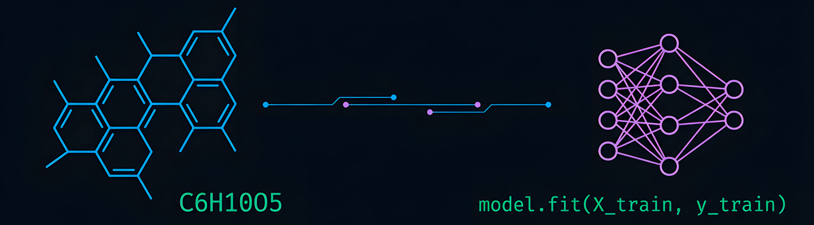

<!-- Banner -->
<div align="center">
  
</div>

<br/>

<!-- Typing animation -->
<div align="center">
  <a href="https://git.io/typing-svg">
    
  </a>
</div>

<br/>

---

## 👨‍🔬 Sobre mí

Soy **Fredy Camilo Bonilla Cristancho**, Ingeniero Químico de la **Universidad Industrial de Santander (UIS)** y Tecnólogo en Análisis y Desarrollo de Software en el **SENA**. Combino la ingeniería química con la inteligencia artificial para construir soluciones reales en la industria alimentaria y el tratamiento de aguas entre otros.

```python
camilo = {
    "ubicación":    "Floridablanca, Santander 🇨🇴",
    "universidad":  "Universidad Industrial de Santander — Ing. Química (2026)",
    "actualmente":  "Modelo ML para clasificación de DBO en aguas superficiales",
    "aprendiendo":  ["Full Stack Development", "Deep Learning", "ADSO - SENA"],
    "intereses":    ["Innovación de productos", "IA aplicada a procesos", "Simulación"],
    "hobbies":      ["☕ Café de especialidad", "🏀 Baloncesto", "⌨️ Programación"],
}
```

---

## 🛠️ Stack Tecnológico

### 🧬 Ingeniería Química & Simulación
<div>
  
  
  
  
</div>

### 💻 Programación & Desarrollo
<div>
  
  
  
  
  
</div>

### 🤖 Machine Learning & IA
<div>
  
  
  
  
  
</div>

### 🎨 Diseño & Herramientas
<div>
  
  
  
  
  
</div>

---

## 🚀 Proyecto Destacado

<div align="center">

### 🌊 Clasificación de DBO mediante Aprendizaje Automático
### *para la Evaluación Ecológica de la Calidad del Agua*
#### Un Marco Transferible con Aplicaciones en Cuencas Hidrográficas

</div>

> Modelo de machine learning que actúa como **sensor blando** para la medición y clasificación de la Demanda Bioquímica de Oxígeno (DBO) en cuerpos de agua, con interfaz web para monitoreo en tiempo real.

<table>
  <tr>
    <td>🧠 <b>Algoritmos</b></td>
    <td>Random Forest · XGBoost · Análisis predictivo</td>
  </tr>
  <tr>
    <td>🌐 <b>Interfaz</b></td>
    <td>Aplicación Web (Python + Node.js)</td>
  </tr>
  <tr>
    <td>📊 <b>Datos</b></td>
    <td>Cuencas hidrográficas</td>
  </tr>
  <tr>
    <td>🎯 <b>Objetivo</b></td>
    <td>Evaluación ecológica y monitoreo ambiental en tiempo real</td>
  </tr>
  <tr>
    <td>🏢 <b>Contexto</b></td>
    <td>Desarrollado en AC Ingeniería · Bucaramanga</td>
  </tr>
</table>

---

## 💼 Experiencia

**🏭 Productos La Victoria** — Práctica en Innovación y Desarrollo *(Sep 2025 – Feb 2026)*
> Desarrollo de tablas nutricionales, app de codificación + dashboard para análisis de sodio (RMN), pruebas de empaque y estimación de vida útil.

**⚗️ AC Ingeniería** — Auxiliar I+D *(Ago 2025 – Feb 2026)*
> Implementación de sensor blando con ML para medir DBO en agua. Desarrollo con Python y Node.js aplicado a procesos químicos.

**📦 Select Bucaramanga** — Asesor Comercial *(2021 – 2024)*
> Gestión de proveedores, validación de empaques, estrategias de diseño visual y análisis de datos de ventas.

---

## 📊 GitHub Stats

<div align="center">
  
  
</div>

<div align="center">
  
</div>

---

## 🎓 Formación Complementaria

| Curso | Institución | Año |
|-------|------------|-----|
| 🤖 Introducción a la IA con Python | Domestika | 2025 |
| ⚗️ Manejo de Productos Químicos | SENA | 2024 |
| 🎨 Producción de Imágenes Digitales | SENA | 2024 |

---

## 📬 Contacto

<div align="center">

[](mailto:fredybonilla217@hotmail.com)
[](#)
[](https://github.com/BonMilow05)

</div>

---

<div align="center">
  
  <br/>
  <sub>⚗️ Química · 🤖 Machine Learning · ☕ Café de Especialidad · 🏀 Baloncesto</sub>
</div>
